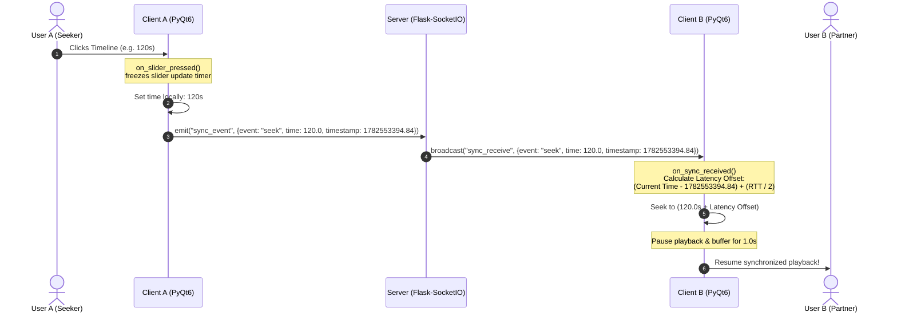

# ourvideo - Developer & AI Agent Guide (AGENTS.md)

Welcome! This guide outlines the system architecture, codebases, file structures, synchronization protocols, and development quirks of the **ourvideo** co-watching platform. Use this document to onboard developers or guide AI coding models reviewing or extending the project.

---

## 0. TL;DR for AI Agents

* **Goal**: A 2-person real-time synchronized video player. Video files are loaded locally (no file streaming); only playback state signals (play, pause, seek, volume, chat) are synchronized via a lightweight WebSocket server.
* **Stack**: PyQt6 + python-vlc + python-socketio (Desktop Client) | Flask-SocketIO (Coordination Backend).
* **Server Deployment**: Deployed on Render free tier at `https://ourvideosrv.onrender.com`. Host spins down after 15 minutes of inactivity (cold start takes ~50s).
* **Key Commands**:
  * Run Client: `python client/main.py`
  * Run Server: `cd server && python app.py`
  * Build Client to EXE: `build_client.bat` (via PyInstaller)
  * Push to Github: `push_to_github.bat` (prompts browser-login credential bypass)
* **Core Rule**: **Do NOT touch VLC Instance flags** without matching architectures. **Do NOT block the PyQt UI thread** with blocking sleeps.

---

## 1. Project Directory Structure & Code Map

```text
ourvideo/
├── client/
│   └── main.py             # Desktop Client (PyQt6 + python-vlc + python-socketio)
├── server/
│   └── app.py              # Flask-SocketIO Backend Server (latency compensation)
├── build_client.bat        # Compiles Python client to standalone executable (PyInstaller)
├── push_to_github.bat      # Helper script for remote git repository push via browser-auth
├── README.md               # User-facing project overview
└── AGENTS.md               # This system architecture & developer guide (onboarding)
```

### Where to Change X (Code Map)

| If you want to... | Look at File:Class | Details / Methods |
|---|---|---|
| Edit custom timeline click/drag | `client/main.py:ClickableSlider` | Overridden `mousePressEvent`/`mouseMoveEvent`/`mouseReleaseEvent` |
| Change seek synchronization math | `client/main.py:MainWindow` | `on_slider_released()`, `on_sync_received()` |
| Handle new room socket messages | `client/main.py:NetworkWorker` | `setup_handlers()`, connect signals in `MainWindow:connect_signals()` |
| Edit server-side room management | `server/app.py` | SocketIO events (`join_room`, `sync_event`, `report_playback_state`) |
| Customize app styling (Dark QSS) | `client/main.py` | `DARK_STYLE` stylesheet string at the top of the file |
| Register a new hotkey shortcut | `client/main.py:MainWindow` | `__init__()` (QShortcut registrations) and bottom handlers |

---

## 2. Sync Data Flow Diagram

The following Mermaid diagram visualizes the synchronization cycle when **User A performs a seek**:



---

## 3. Server Architecture (`/server/app.py`)

The server is a lightweight WebSockets coordinator. It does not store user accounts or database entries. Instead, it manages temporary, in-memory sync rooms.

### Key Data Structures (In-Memory)
* `ROOMS`: A dictionary mapping room codes (e.g. `12345`) to room data:
  ```json
  {
    "users": ["sid_1", "sid_2"],
    "files": {
      "sid_1": {"filename": "movie.mp4", "size": 1048576, "duration": 7200.0},
      "sid_2": {"filename": "movie.mp4", "size": 1048576, "duration": 7200.0}
    }
  }
  ```
* `SID_TO_ROOM`: Fast lookup mapping user Socket.io session IDs (`sid`) to active room codes.

### Key Protocols
1. **Room Creation**: Users send `create_room`. Server generates a unique 5-character alphanumeric room code, registers the user, and puts them in a WebSocket room.
2. **Room Joining & Initial State Catch-up Sync**:
   * When a second user joins, the server sends a `request_playback_state` event specifically to the **Host** (the first user in the room).
   * The Host reports their current timestamp and playing/paused state via `report_playback_state`.
   * The server relays this state to the newcomer via `set_playback_state`, letting them jump to the host's exact position instantly.
3. **File Verification**: When both users join and upload file info, the server compares the name, size, and duration. It emits `file_status` (`match: true` or `match: false`) so clients get visual warnings if they are playing different files.
4. **Disconnect Cleanups**: If a client disconnects, the server leaves the room, notifies the remaining partner, and deletes the room from memory if both users have left.

---

## 4. Client Architecture (`/client/main.py`)

The client is a premium desktop video player built with **PyQt6** and **python-vlc** bindings. It implements a beautiful, dark-themed, glassmorphic layout.

### UI Components Hierarchy
* `MainWindow` (QMainWindow):
  * **Top Header Glass Bar**: Shows brand logo, loaded video metadata, ping latency, connection status dot, and a clipboard copy button.
  * **Stacked Pages (Empty vs Player)**:
    * Index 0: `EmptyStateWidget` (cinema-themed landing screen with CTA drag-and-drop / Select Video button).
    * Index 1: `video_container` frame (holds the player output widget).
  * **Floating Toast System**: `ToastNotification` overlay banner that fades in/out on the top center of the screen to notify actions (seek times, connection events, volumes).
  * **Chat Sidebar Panel**: Collapsible panel for room text chat (toggled with `💬` or keybind `C`).
  * **Bottom Netflix-Style Control Bar**: Hosts Play/Pause, Open File, Settings Modal trigger, chat toggle, volume button (with dynamic icons `🔇`/`🔈`/`🔉`/`🔊`), and the timeline slider.

### Critical Custom Subclasses & Handlers
1. **`ClickableSlider`** (subclassed from `QSlider`):
   * Standard Qt sliders only allow page-step movements on click.
   * `ClickableSlider` overrides mouse presses (`mousePressEvent`), moves (`mouseMoveEvent`), and releases (`mouseReleaseEvent`).
   * It calculates the click coordinate relative to the slider width, translates it to absolute value, and triggers seeks immediately on mouse release. This permits YouTube-like click-scrubbing.
2. **`ToastNotification`** (subclassed from `QLabel`):
   * Uses `QGraphicsOpacityEffect` and `QPropertyAnimation` to fade in, remain visible, and fade out smoothly.
3. **Window state change (`changeEvent`)**:
   * Overridden to detect fullscreen transitions. When entering fullscreen, it runs a 200ms delayed trigger to hide controls (Netflix-style autohide after 3 seconds).
   * In windowed mode, autohide is disabled to keep layouts stable and prevent native VLC Win32 handle overlaps.
4. **Global Keybind Shortcuts (`QShortcut`)**:
   * Bound to window scope so they work even if sliders or buttons have active focus.
   * Shortcut keys: `Space` (Play/Pause), `Left/Right` (Seek 5s), `M` (Mute), `F` (Fullscreen), `C` (Chat Drawer), `S` (Settings Modal).
   * They automatically bypass actions if the chat input box has keyboard focus (`chat_input.hasFocus()`).

---

## 5. Latency & Clock Synchronization Protocol

To compensate for network latency during real-time seeking:
* Every 5 seconds, the client pings the server to calculate **Round-Trip Time (RTT)**.
  $$\text{Latency} = \text{RTT} / 2$$
* When User A performs a seek, play, or pause, the payload includes the video time and User A's local UNIX machine timestamp.
* When User B receives it, User B calculates the latency offset:
  $$\text{Latency Offset} = (\text{Current UNIX Time} - \text{Sender's UNIX Timestamp}) + \text{Latency}$$
* User B seeks to:
  $$\text{Target Video Time} + \text{Latency Offset}$$
* A 1-second buffer pause is applied to let the VLC decoder buffer the seek and stabilize before resuming playback.

---

## 6. Config & Constants

Configurations are located directly at the top of the codebase to allow easy customization:

| Constant / Config | Default Value | Located In | Purpose |
|---|---|---|---|
| `SERVER_URL` | `https://ourvideosrv.onrender.com` | `client/main.py` (settings modal default) | SocketIO Server address |
| `wait_timeout` | `30` | `client/main.py` (`connect_server()`) | Maximum seconds client waits for server cold start |
| `PING_INTERVAL` | `5` seconds | `client/main.py` (`__init__()` ping timer) | How often ping packets are sent to calculate latency |
| `hide_timer` interval | `3000` ms (3 seconds) | `client/main.py` (`__init__()` hide timer) | Inactivity threshold before controls hide in fullscreen |
| `update_timer` interval | `200` ms | `client/main.py` (`__init__()` update timer) | Refresh rate of player timeline slider |

---

## 7. Known Issues & Limitations

1. **VLC 3.0.20 + Win11 Fullscreen Flashing**: On certain Windows 11 graphics configurations, entering/exiting fullscreen causes the Windows taskbar to flash white for a split second. **By Design**: This is a native VLC/Qt handle swap delay issue, not an application-level bug.
2. **MKV Chapter Seeking**: Scrubbing directly onto chapter markers causes a ~1-2s desync while the decoder reads metadata. **Mitigation**: Standard latency compensation and the 1s pause buffer automatically stabilize this.
3. **Render Free Tier Cold Start**: If the app has not been used for 15 minutes, connection will hang for ~50s. **By Design**: Render free tier puts containers to sleep. The client timeout is configured to `30s` to tolerate cold starts. Open the Render URL in a browser to wake it up instantly.

---

## 8. Before Commit Verification Checklist

Before pushing any PR or commits, verify the following checklist:

- [ ] **Dual Client Sync**: Open two client windows, connect to a room, and click seek/play. Both clients must stay synced within `500ms`.
- [ ] **File Info Warning**: Connect to a room, load a file on Client A, and a different file (or size/duration) on Client B. Verify that the file verification status dialog pops up warning both users.
- [ ] **Fullscreen Exit Controls**: Enter Fullscreen mode, wait 3 seconds for controls to hide. Exit Fullscreen (ESC or F) and verify that top/bottom control bars are fully visible again and layout has not collapsed.
- [ ] **Keyboard Shortcuts Focus Bypass**: Focus on the volume slider or folders button, click `Space` to pause, `M` to mute, and verify that keyboard shortcuts work. Click inside the chat input box, type characters (including spaces), and verify that shortcuts are ignored.
- [ ] **Standalone Compilation**: Execute `build_client.bat` to verify that PyInstaller packages the executable cleanly without syntax or missing import errors.
